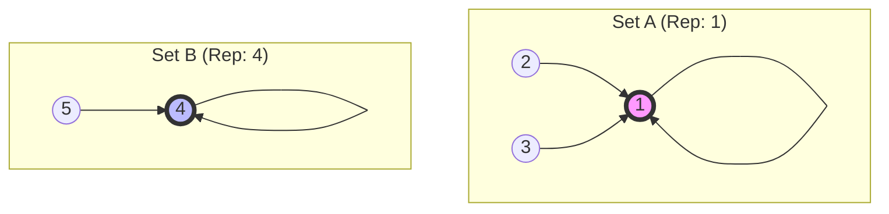

# Disjoint Set (Union-Find)

> **한 줄 요약**: 서로소 집합(Disjoint Set)을 효율적으로 관리하기 위해 트리 구조를 활용하며, 합집합(Union)과 탐색(Find) 연산을 거의 상수 시간에 수행하는 알고리즘입니다.

---

## 1. 개념 (Concept)

### 1.1 정의
- **Disjoint Set (서로소 집합)**: 공통 원소가 없는 부분 집합들로 나누어진 원소들의 모임입니다.
- **Union-Find**: 서로소 집합을 관리하는 데 필요한 두 가지 핵심 연산을 의미합니다.
    - **Union**: 두 개의 집합을 하나로 합칩니다.
    - **Find**: 특정 원소가 어떤 집합에 속해 있는지(대표 원소가 무엇인지) 알아냅니다.

### 1.2 핵심 원리 (Core Principles)
- 각 집합을 **트리(Tree)** 형태로 표현합니다.
- 트리의 **루트 노드(Root Node)**가 해당 집합의 **대표자(Representative)** 역할을 합니다.
- 모든 자식 노드는 부모 노드를 가리키며, 루트 노드는 자기 자신을 부모로 가리킵니다.


*(두 개의 서로소 집합 예시. 1과 4가 각 집합의 대표 노드)*

---

## 2. 구현 및 사용법 (Implementation)

### 2.1 기본 연산
1. **Make-Set(x)**: 원소 x만으로 구성된 집합을 생성합니다. (초기화: `parent[x] = x`)
2. **Find-Set(x)**: x가 속한 집합의 루트 노드를 찾습니다. 재귀적으로 부모를 타고 올라갑니다.
3. **Union(x, y)**: x와 y가 속한 두 집합을 합칩니다. 일반적으로 `Find(x)`와 `Find(y)`를 통해 루트를 찾은 뒤, 한쪽 루트를 다른 쪽 루트의 자식으로 연결합니다.

### 2.2 Java 구현 예시 (최적화 포함)
실무 및 알고리즘 문제 해결(PS)에서 주로 사용되는 **경로 압축(Path Compression)**과 **Rank 기반 합치기(Union by Rank)**가 적용된 버전입니다.

```java
public class UnionFind {
    private int[] parent;
    private int[] rank;

    // 생성자: Make-Set
    public UnionFind(int n) {
        parent = new int[n + 1];
        rank = new int[n + 1];
        for (int i = 1; i <= n; i++) {
            parent[i] = i; // 자기 자신을 부모로 초기화
            rank[i] = 0;   // 트리의 높이(랭크) 초기화
        }
    }

    // Find-Set: 경로 압축(Path Compression) 적용
    public int find(int x) {
        if (parent[x] != x) {
            // 루트를 찾을 때까지 재귀 호출하며, 찾은 루트를 부모로 갱신
            parent[x] = find(parent[x]);
        }
        return parent[x];
    }

    // Union: Rank 기반 합치기(Union by Rank) 적용
    public void union(int x, int y) {
        int rootX = find(x);
        int rootY = find(y);

        if (rootX != rootY) {
            // 높이가 낮은 트리를 높은 트리 밑에 붙임
            if (rank[rootX] < rank[rootY]) {
                parent[rootX] = rootY;
            } else if (rank[rootX] > rank[rootY]) {
                parent[rootY] = rootX;
            } else {
                // 높이가 같다면 임의로 합치고 랭크 증가
                parent[rootY] = rootX;
                rank[rootX]++;
            }
        }
    }
}
```

---

## 3. 심화 (Deep Dive)

### 3.1 최적화 기법 (Optimizations)
단순히 구현하면 트리가 한쪽으로 치우쳐(Skewed) 연결 리스트처럼 되어 성능이 저하될 수 있습니다. 이를 방지하기 위해 두 가지 기법을 사용합니다.

1.  **경로 압축 (Path Compression)**
    - `Find` 연산을 수행하면서 만나는 모든 노드들이 직접 루트를 가리키도록 부모 포인터를 갱신합니다.
    - 다음 번 `Find` 호출 시 경로가 매우 짧아집니다.

2.  **Union by Rank (또는 Union by Height)**
    - 트리를 합칠 때, 항상 높이(Rank)가 낮은 트리를 높은 트리 밑에 붙입니다.
    - 이렇게 하면 트리의 전체 높이가 불필요하게 증가하는 것을 막을 수 있습니다.
    - 두 트리의 높이가 같을 때만 합쳐진 트리의 높이가 1 증가합니다.

### 3.2 시간 복잡도 (Time Complexity)
- **최적화 미적용 시**: 최악의 경우 $O(N)$ (트리 높이만큼 탐색)
- **최적화 적용 시**: **$O(\alpha(N))$**
    - $\alpha(N)$은 애커만 함수(Ackermann Function)의 역함수로, $N$이 $2^{65536}$일 때도 5 이하의 값을 가집니다.
    - 따라서 실질적으로 **상수 시간(Amortized Constant Time)**에 가깝게 동작합니다.

### 3.3 활용 사례
- **그래프의 연결성 확인**: 두 노드가 같은 컴포넌트에 속해 있는지 확인.
- **Kruskal 알고리즘**: 최소 신장 트리(MST)를 구할 때 사이클 생성 여부 판단.
- **이미지 프로세싱**: 픽셀 그룹화(Connected Component Labeling).

---

## 4. 요약 및 체크리스트 (Summary)
- [ ] **서로소 집합**은 교집합이 없는 집합들을 관리한다.
- [ ] **Find**는 루트를 찾고, **Union**은 두 트리를 합친다.
- [ ] **경로 압축**과 **Union by Rank**를 적용하면 성능이 비약적으로 향상된다.
- [ ] 시간 복잡도는 사실상 **상수 시간**($O(\alpha(N))$)이다.
- [ ] 사이클 판별이나 네트워크 연결 확인에 필수적이다.

---
*Ref: CLRS Chapter 21 (Data Structures for Disjoint Sets)*