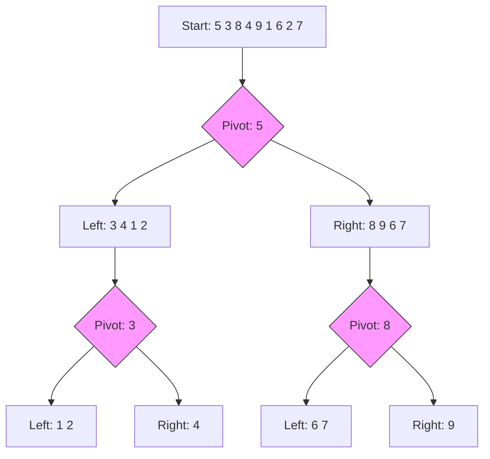

# Quick Sort (퀵 정렬)

> **한 줄 요약**: 분할 정복(Divide and Conquer) 전략을 사용하여 피벗(Pivot)을 기준으로 배열을 두 부분으로 나누고 재귀적으로 정렬하는 평균 $O(n \log n)$ 알고리즘입니다.

---

## 1. 개념 (Concept)

### 1.1 정의
- **Quick Sort**: 하나의 리스트를 피벗(Pivot)을 기준으로 두 개의 비균등한 크기로 분할하고, 분할된 부분 리스트를 정렬한 다음, 두 개의 정렬된 부분 리스트를 합하여 전체가 정렬된 리스트가 되게 하는 방법입니다.
- **Divide and Conquer**: 문제를 작은 2개의 문제로 분리하고 각각을 해결한 다음, 결과를 모아서 원래의 문제를 해결하는 전략입니다.

### 1.2 핵심 원리 (Core Principles)
1. **Pivot Selection**: 리스트 가운데서 하나의 원소를 고릅니다. 이를 피벗이라고 합니다.
2. **Partitioning**: 피벗 앞에는 피벗보다 값이 작은 모든 원소들이 오고, 피벗 뒤에는 피벗보다 값이 큰 모든 원소들이 오도록 리스트를 둘로 나눕니다.
3. **Recursion**: 분할된 두 개의 작은 리스트에 대해 재귀적으로 이 과정을 반복합니다.


*(피벗 5를 기준으로 작은 값은 왼쪽, 큰 값은 오른쪽으로 분할)*

---

## 2. 구현 및 사용법 (Implementation)

### 2.1 Partitioning 전략
가장 널리 쓰이는 **Lomuto Partition** 방식과 **Hoare Partition** 방식이 있습니다. 여기서는 구현이 직관적인 Lomuto 방식을 소개합니다. (마지막 원소를 피벗으로 선택)

### 2.2 Java 구현 예시
```java
public class QuickSort {
    
    public void sort(int[] arr, int low, int high) {
        if (low < high) {
            // pi는 파티셔닝 인덱스, arr[pi]는 정렬된 위치에 있음
            int pi = partition(arr, low, high);

            // 피벗을 기준으로 분할하여 재귀 호출
            sort(arr, low, pi - 1);  // 피벗보다 작은 부분
            sort(arr, pi + 1, high); // 피벗보다 큰 부분
        }
    }

    // Lomuto Partition Scheme
    private int partition(int[] arr, int low, int high) {
        int pivot = arr[high]; // 마지막 원소를 피벗으로 선택
        int i = (low - 1); // 작은 원소들의 경계 인덱스

        for (int j = low; j < high; j++) {
            // 현재 원소가 피벗보다 작거나 같으면
            if (arr[j] <= pivot) {
                i++;
                swap(arr, i, j); // 경계 확장 및 교환
            }
        }
        // 피벗을 올바른 위치(작은 원소들 바로 뒤)로 이동
        swap(arr, i + 1, high);
        return i + 1;
    }

    private void swap(int[] arr, int i, int j) {
        int temp = arr[i];
        arr[i] = arr[j];
        arr[j] = temp;
    }
}
```

---

## 3. 심화 (Deep Dive)

### 3.1 시간 복잡도 (Time Complexity)
| 경우 | 복잡도 | 설명 |
| :--- | :--- | :--- |
| **Best / Average** | **$O(n \log n)$** | 피벗이 리스트를 절반에 가깝게 나눌 때. |
| **Worst** | **$O(n^2)$** | 이미 정렬된 배열에서 첫/마지막 원소를 피벗으로 잡을 때 (불균형 분할). |

### 3.2 공간 복잡도 (Space Complexity)
- **$O(\log n)$**: 재귀 호출 스택의 깊이만큼 메모리가 필요합니다. (In-place 정렬이지만 스택 프레임 사용)

### 3.3 최적화 및 변형
1.  **Randomized Quick Sort**: 피벗을 무작위로 선택하여 최악의 경우($O(n^2)$) 발생 확률을 극도로 낮춥니다.
2.  **Median-of-Three**: 첫 번째, 중간, 마지막 원소 중 중간값을 피벗으로 선택합니다.
3.  **Insertion Sort 혼용**: 배열의 크기가 작을 때(예: 10~20 이하)는 오버헤드가 적은 Insertion Sort로 전환합니다.
4.  **Dual-Pivot Quick Sort**: 두 개의 피벗을 사용하여 3개의 영역으로 분할합니다. (Java `Arrays.sort()`의 기본 구현)

### 3.4 Merge Sort와의 비교
- **Quick Sort**: In-place 정렬(추가 메모리 적음), 캐시 지역성(Locality) 좋음, Unstable Sort.
- **Merge Sort**: 추가 메모리 $O(n)$ 필요, Stable Sort, 최악의 경우에도 $O(n \log n)$ 보장.

---

## 4. 요약 및 체크리스트 (Summary)
- [ ] **분할 정복** 알고리즘의 대표적인 예시이다.
- [ ] **피벗(Pivot)** 선택이 성능을 좌우한다.
- [ ] 평균적으로 가장 빠른 정렬 중 하나이지만, 최악의 경우 **$O(n^2)$**이 될 수 있다.
- [ ] **불안정 정렬(Unstable Sort)**이다.
- [ ] Java의 `Arrays.sort()` (Primitive type) 내부에서 Dual-Pivot Quick Sort를 사용한다.

---
*Ref: CLRS Chapter 7 (Quicksort)*