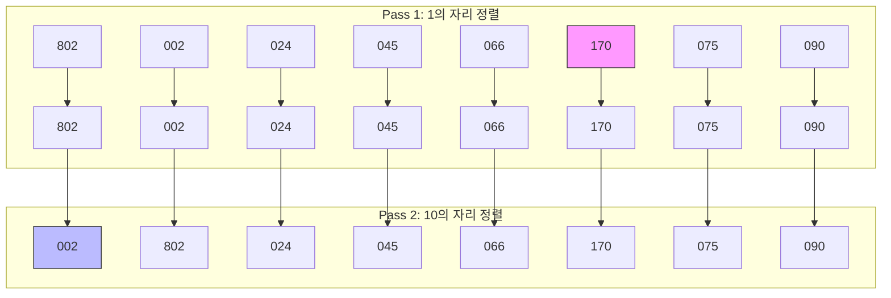

# Radix Sort (기수 정렬)

> **한 줄 요약**: 데이터의 값을 비교하지 않고, 자릿수(Digit)별로 버킷에 분류하여 정렬하는 $O(dn)$ 시간 복잡도의 안정 정렬 알고리즘입니다.

---

## 1. 개념 (Concept)

### 1.1 정의
- **Radix Sort**: 비교 연산(Comparison)을 수행하지 않고, 데이터의 각 자릿수를 낮은 자리수(LSD)부터 높은 자리수(MSD)까지 순서대로 처리하여 정렬하는 알고리즘입니다.
- **Non-comparison Sort**: 두 원소의 대소를 직접 비교하지 않으므로, 비교 정렬의 하한선인 $O(n \log n)$을 깰 수 있습니다.

### 1.2 핵심 원리 (Core Principles)
- **LSD (Least Significant Digit)**: 가장 낮은 자릿수(1의 자리)부터 정렬을 시작합니다. 구현이 간단하고 일반적인 정수 정렬에 주로 사용됩니다.
- **Stable Sort (안정 정렬)**: 자릿수별 정렬 시, 같은 값을 가진 원소들의 기존 순서가 유지되어야 합니다. 이는 상위 자릿수 정렬 시 하위 자릿수의 정렬 상태를 깨뜨리지 않기 위해 필수적입니다.
- **Bucket**: 각 자릿수의 값(0~9)에 따라 데이터를 담을 공간(Queue 또는 Count 배열)이 필요합니다.


*(LSD 방식: 1의 자리 정렬 후, 그 순서를 유지하며 10의 자리 정렬 수행)*

---

## 2. 구현 및 사용법 (Implementation)

### 2.1 알고리즘 단계 (LSD 기준)
1. 입력 데이터 중 가장 큰 수의 자릿수($d$)를 파악합니다.
2. 1의 자리부터 $d$번째 자리까지 반복합니다.
3. 각 단계마다 해당 자릿수를 기준으로 **Counting Sort** (또는 안정적인 버킷 정렬)를 수행합니다.
4. 모든 자릿수에 대한 정렬이 끝나면 최종 정렬이 완료됩니다.

### 2.2 Java 구현 예시
가장 널리 쓰이는 **LSD + Counting Sort** 방식입니다.

```java
import java.util.Arrays;

public class RadixSort {
    
    // 메인 정렬 함수
    public static void radixSort(int[] arr) {
        if (arr.length == 0) return;

        // 1. 최대값 찾기 (최대 자릿수 파악용)
        int max = Arrays.stream(arr).max().getAsInt();

        // 2. 자릿수별(exp)로 Counting Sort 수행
        // exp: 1, 10, 100, ...
        for (int exp = 1; max / exp > 0; exp *= 10) {
            countingSortByDigit(arr, exp);
        }
    }

    // 특정 자릿수(exp) 기준의 Counting Sort
    private static void countingSortByDigit(int[] arr, int exp) {
        int n = arr.length;
        int[] output = new int[n]; // 임시 결과 저장
        int[] count = new int[10]; // 0~9 카운트

        // A. 빈도수 계산
        for (int i = 0; i < n; i++) {
            int digit = (arr[i] / exp) % 10;
            count[digit]++;
        }

        // B. 누적합 계산 (위치 인덱스 결정)
        for (int i = 1; i < 10; i++) {
            count[i] += count[i - 1];
        }

        // C. 출력 배열에 배치 (Stable 유지를 위해 뒤에서부터 순회)
        for (int i = n - 1; i >= 0; i--) {
            int digit = (arr[i] / exp) % 10;
            output[count[digit] - 1] = arr[i];
            count[digit]--;
        }

        // D. 원본 배열에 복사
        System.arraycopy(output, 0, arr, 0, n);
    }
}
```

---

## 3. 심화 (Deep Dive)

### 3.1 시간 복잡도 (Time Complexity)
- **$O(d \times (n + k))$**
    - $d$: 최대 자릿수 (데이터의 거대함에 비례)
    - $n$: 데이터의 개수
    - $k$: 기수(Base), 10진수일 경우 10
- $d$가 상수(예: int형 32비트 정수)라고 가정하면 **$O(n)$**에 근접한 선형 시간을 가집니다.
- 하지만 $d$가 $n$에 비례할 정도로 크다면 $O(n^2)$이 될 수도 있습니다.

### 3.2 공간 복잡도 (Space Complexity)
- **$O(n + k)$**
    - 정렬 결과를 담을 임시 배열($n$)과 카운트 배열($k$)이 필요합니다.
    - In-place 정렬이 아니므로 메모리 사용량에 주의해야 합니다.

### 3.3 장단점 및 활용
| 장점 | 단점 |
| :--- | :--- |
| 비교 정렬($O(n \log n)$)보다 빠를 수 있음 | 자릿수가 있는 데이터(정수, 문자열)에만 적용 가능 |
| 안정 정렬(Stable Sort)임 | 부동소수점 실수에는 적용하기 까다로움 |
| | 추가 메모리 공간이 필요함 |

### 3.4 최적화: 기수(Base) 변경
- 기본적으로 10진수(Base 10)를 쓰지만, 컴퓨터 친화적인 **2의 거듭제곱(Base 256 등)**을 사용하면 비트 연산(`>>`, `&`)을 통해 나눗셈/나머지 연산보다 훨씬 빠르게 자릿수를 추출할 수 있습니다.

---

## 4. 요약 및 체크리스트 (Summary)
- [ ] **비교 없는 정렬**: 자릿수 분류를 통해 정렬한다.
- [ ] **LSD 방식**: 낮은 자릿수부터 정렬하며, **안정 정렬**이 필수적이다.
- [ ] **시간 복잡도**: $O(dn)$으로, 자릿수가 적은 대량의 데이터에 매우 효율적이다.
- [ ] **제약 사항**: 실수나 자릿수가 정의되지 않은 데이터에는 사용하기 어렵다.

---
*Ref: CLRS Chapter 8 (Sorting in Linear Time)*