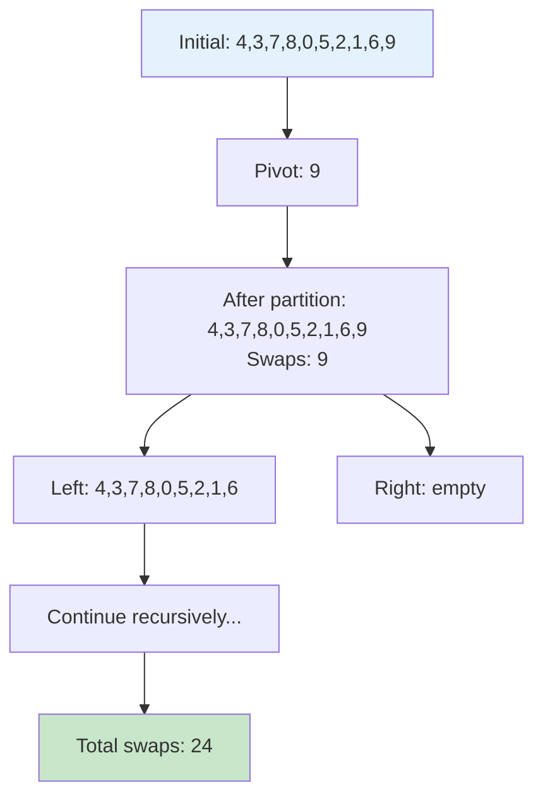

# QuickSort 교환 회수 계산 - 해결 방법

## 문제 분석
- QuickSort 알고리즘 구현
- 특정 partition 방법 사용 (책에서 제시된 방법)
- 배열 원소들 간의 교환 회수 계산

## QuickSort 메커니즘 추적 다이어그램

```mermaid
graph TD
    A[Start: quickSort(A, 0, n-1)] --> B{p < r?}
    B -->|No| C[Return - Base Case]
    B -->|Yes| D[Call partition(A, p, r)]
    
    D --> E[Set pivot x = A[r]]
    E --> F[Initialize i = p - 1]
    F --> G[Loop j from p to r-1]
    
    G --> H{A[j] <= x?}
    H -->|Yes| I[Increment i<br/>Swap A[i] ↔ A[j]<br/>Count++]
    H -->|No| J[Continue loop]
    
    I --> K{j < r-1?}
    J --> K
    K -->|Yes| G
    K -->|No| L[Final swap: A[i+1] ↔ A[r]<br/>Count++]
    
    L --> M[Return q = i+1]
    M --> N[Recursive call: quickSort(A, p, q-1)]
    N --> O[Recursive call: quickSort(A, q+1, r)]
    O --> P[End]
    
    style A fill:#e1f5fe
    style C fill:#c8e6c9
    style P fill:#c8e6c9
    style I fill:#fff3e0
    style L fill:#fff3e0
```

## 알고리즘 구현 전략

### 1. Partition 함수
```java
private static int partition(int[] A, int p, int r) {
    int x = A[r];           // 피벗 선택 (마지막 원소)
    int i = p - 1;          // 작은 원소들의 경계
    
    for (int j = p; j < r; j++) {
        if (A[j] <= x) {
            i++;
            swap(A, i, j);   // 교환 회수 증가
            swapCount++;
        }
    }
    swap(A, i + 1, r);      // 피벗을 올바른 위치로
    swapCount++;
    return i + 1;
}
```

### 2. 교환 회수 추적
- 전역 변수 `swapCount`로 교환 횟수 관리
- partition에서 조건을 만족할 때마다 증가
- 마지막 피벗 배치 시에도 증가

### 3. QuickSort 재귀 구조
```java
private static void quickSort(int[] A, int p, int r) {
    if (p < r) {
        int q = partition(A, p, r);
        quickSort(A, p, q - 1);
        quickSort(A, q + 1, r);
    }
}
```

## 예제 추적

입력: `[4, 3, 7, 8, 0, 5, 2, 1, 6, 9]`

### 교환 과정 시각화


## 시간 복잡도
- 평균: O(n log n)
- 최악: O(n²)
- 공간: O(log n) - 재귀 스택

## 핵심 포인트
1. 정확한 partition 구현 (책의 방법 준수)
2. 교환 회수 정확한 카운팅
3. 재귀 호출의 올바른 범위 설정