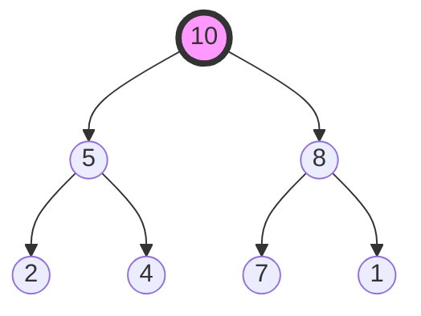

# Heap Sort (힙 정렬)

> **한 줄 요약**: 완전 이진 트리 기반의 힙(Heap) 자료구조를 이용하여 최댓값(또는 최솟값)을 반복적으로 추출하는 O(n log n) 정렬 알고리즘입니다.

---

## 1. 개념 (Concept)

### 1.1 정의
- **Heap**: 최댓값이나 최솟값을 빠르게 찾아내기 위해 고안된 완전 이진 트리(Complete Binary Tree)입니다.
- **Max Heap**: 부모 노드의 키 값이 자식 노드의 키 값보다 항상 크거나 같은 힙입니다.
- **Heap Sort**: 주어진 데이터를 힙으로 만든(Build Heap) 후, 루트(최댓값)를 꺼내 배열의 뒤쪽으로 보내는 과정을 반복하여 정렬합니다.

### 1.2 핵심 원리 (Core Principles)
배열을 완전 이진 트리로 해석하여 인덱스 연산만으로 부모-자식 관계를 다룹니다.

- **인덱스 규칙 (0-based)**:
    - `Parent(i) = (i-1) / 2`
    - `Left Child(i) = 2*i + 1`
    - `Right Child(i) = 2*i + 2`


*(Max Heap 예시: 루트 10이 가장 큼)*

---

## 2. 구현 및 사용법 (Implementation)

### 2.1 알고리즘 단계
1. **Build Heap**: 입력 배열을 Max Heap 상태로 만듭니다. (Bottom-up 방식, O(n))
2. **Extract Max**: 루트(0번)와 마지막 원소를 교환(Swap)합니다.
3. **Heapify (Percolate Down)**: 힙 크기를 1 줄이고, 새로운 루트를 적절한 위치로 내립니다.
4. 힙 크기가 1이 될 때까지 2~3번을 반복합니다.

### 2.2 Pseudocode
```text
heapSort(A, n):
  buildHeap(A, n)              // O(n)
  for end from n-1 downto 1:
    swap(A[0], A[end])         // 최댓값을 맨 뒤로
    percolateDown(A, end, 0)   // 힙 속성 복구, O(log n)
```

### 2.3 Java 구현 예시
```java
public class HeapSort {
    public void sort(int[] arr) {
        int n = arr.length;

        // 1. Build Heap
        for (int i = n / 2 - 1; i >= 0; i--)
            heapify(arr, n, i);

        // 2. Extract elements
        for (int i = n - 1; i > 0; i--) {
            swap(arr, 0, i); // Move current root to end
            heapify(arr, i, 0); // Call max heapify on the reduced heap
        }
    }

    void heapify(int[] arr, int n, int i) {
        int largest = i;
        int l = 2 * i + 1;
        int r = 2 * i + 2;

        if (l < n && arr[l] > arr[largest]) largest = l;
        if (r < n && arr[r] > arr[largest]) largest = r;

        if (largest != i) {
            swap(arr, i, largest);
            heapify(arr, n, largest);
        }
    }
    // swap 메서드 생략
}
```

---

## 3. 심화 (Deep Dive)

### 3.1 시간 복잡도 (Time Complexity)
| 단계 | 복잡도 | 설명 |
| :--- | :--- | :--- |
| **Build Heap** | **O(n)** | 하위 레벨 노드가 많지만 높이가 낮아 합산 시 O(n)에 수렴함 |
| **Extract & Heapify** | **O(n log n)** | n개의 원소에 대해 높이(log n)만큼 이동 |
| **전체 (Total)** | **O(n log n)** | Best, Average, Worst 모두 동일 |

### 3.2 공간 복잡도 및 특징
- **In-place**: 추가 메모리가 거의 필요 없습니다(O(1)). 재귀 호출 스택 제외 시.
- **Unstable**: 동일한 값의 순서가 보장되지 않습니다. (Swap 과정에서 뒤섞임)
- **Cache Locality**: 배열 인덱스를 2배씩 점프하므로 캐시 적중률이 Quick/Merge Sort에 비해 낮습니다.

### 3.3 vs 다른 정렬 알고리즘
- **vs Quick Sort**: 퀵 정렬이 평균적으로 더 빠르지만(캐시 효율, 상수 계수), 힙 정렬은 최악의 경우에도 O(n log n)을 보장합니다.
- **vs Merge Sort**: 병합 정렬은 O(n)의 추가 메모리가 필요하지만 Stable합니다.

---

## 4. 요약 및 체크리스트 (Summary)
- [ ] **완전 이진 트리** 구조를 배열로 효율적으로 구현한다.
- [ ] **Build Heap**은 O(n) 시간이 걸린다.
- [ ] 전체 시간 복잡도는 항상 **O(n log n)**이다.
- [ ] **불안정 정렬(Unstable Sort)**이며, 캐시 효율이 좋지 않다.
- [ ] 우선순위 큐(Priority Queue) 구현의 기반이 된다.

---
*Ref: CLRS Chapter 6 (Heapsort)*