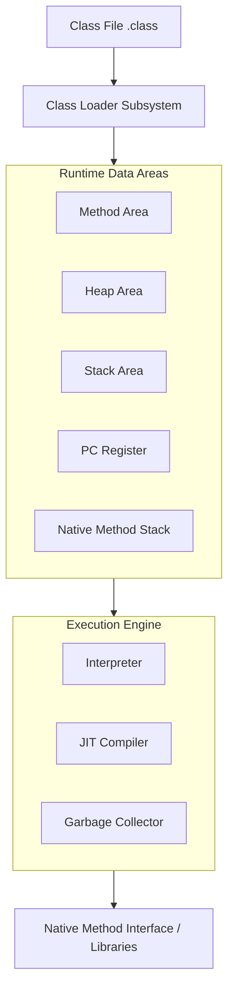

# JVM Internals (Java Virtual Machine 내부 구조)

> **한 줄 요약**: 자바 애플리케이션을 실행하는 가상 머신인 JVM의 아키텍처(Class Loader, Memory, Execution Engine)와 동작 원리를 심층 분석합니다.

---

## 1. 개념 (Concept)

### 1.1 JVM이란?
- **정의**: Java Bytecode(`.class`)를 OS에 맞게 해석하여 실행하는 가상 머신입니다.
- **특징**:
    - **플랫폼 독립성**: "Write Once, Run Anywhere" (OS에 종속되지 않음).
    - **메모리 관리**: Garbage Collection(GC)을 통해 메모리를 자동으로 관리합니다.

### 1.2 전체 아키텍처
JVM은 크게 세 가지 서브시스템으로 구성됩니다.

---

## 2. 주요 구성 요소 (Components)

### 2.1 Class Loader Subsystem
컴파일된 `.class` 파일을 런타임에 동적으로 로드하고 링크하는 역할을 합니다.
1. **Loading**: 클래스 파일을 읽어 메모리에 적재.
2. **Linking**: 검증(Verify) -> 준비(Prepare, 메모리 할당) -> 해결(Resolve, 심볼릭 참조를 직접 참조로 변경).
3. **Initialization**: static 변수 초기화 및 static 블록 실행.

### 2.2 Runtime Data Areas (Memory)
JVM이 OS로부터 할당받은 메모리 영역입니다.

| 영역 | 설명 | 공유 여부 |
| :--- | :--- | :--- |
| **Method Area** | 클래스 정보, static 변수, 상수 풀 저장 | 모든 스레드 공유 |
| **Heap Area** | `new`로 생성된 객체와 배열 저장 (GC 대상) | 모든 스레드 공유 |
| **Stack Area** | 메서드 호출 시 프레임(Local 변수, Operand Stack) 저장 | 스레드별 독립 |
| **PC Register** | 현재 실행 중인 JVM 명령 주소 저장 | 스레드별 독립 |
| **Native Stack** | C/C++ 등 네이티브 메서드 실행을 위한 스택 | 스레드별 독립 |

### 2.3 Execution Engine
메모리에 로드된 바이트코드를 실행합니다.
- **Interpreter**: 바이트코드를 한 줄씩 해석하여 실행 (초기 실행 속도 빠름, 전체 수행 느림).
- **JIT Compiler (Just-In-Time)**: 반복되는 코드(Hotspot)를 네이티브 기계어로 컴파일하여 캐싱 (실행 속도 비약적 향상).
- **Garbage Collector**: Heap 영역에서 참조되지 않는 객체를 제거.

---

## 3. 심화 (Deep Dive)

### 3.1 Garbage Collection (GC) 동작 원리
- **Reachability**: Root Set(Stack 변수, Static 변수 등)에서 참조가 닿을 수 있는 객체는 살아남고, 닿지 않으면 GC 대상이 됩니다.
- **Generational GC**:
    - **Young Generation**: 갓 생성된 객체. 대부분 여기서 금방 사라짐 (Minor GC).
    - **Old Generation**: Young에서 오랫동안 살아남은 객체가 이동. 크기가 크고 GC가 덜 발생 (Major GC).

### 3.2 JIT 컴파일러 최적화 기법
- **Method Inlining**: 자주 호출되는 메서드의 코드를 호출부로 복사하여 오버헤드 제거.
- **Dead Code Elimination**: 실행될 가능성이 없는 코드 제거.
- **Loop Unrolling**: 루프 오버헤드를 줄이기 위해 반복문을 펼침.

### 3.3 Class Loader 계층 구조
- **Bootstrap Class Loader**: `JAVA_HOME/lib`의 핵심 라이브러리 로드 (Native C++ 구현).
- **Extension (Platform) Class Loader**: `ext` 디렉토리의 확장 라이브러리 로드.
- **Application (System) Class Loader**: Classpath(`-cp`)에 지정된 사용자 클래스 로드.

---

## 4. 요약 및 체크리스트 (Summary)
- [ ] **Class Loader**는 런타임에 클래스를 로드/링크/초기화한다.
- [ ] **Method/Heap**은 모든 스레드가 공유하고, **Stack/PC**는 스레드별로 독립적이다.
- [ ] **JIT 컴파일러**는 인터프리터의 성능 단점을 보완하기 위해 자주 쓰는 코드를 기계어로 변환한다.
- [ ] **GC**는 Reachability 분석을 통해 힙 메모리를 관리한다.

---
*Ref: JVM Specification, Oracle HotSpot VM Guide*