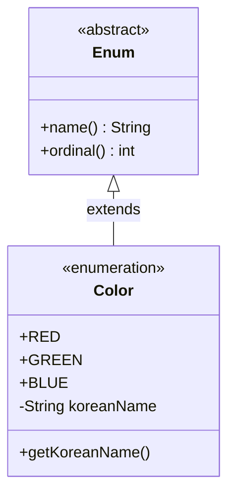

# [Java] Enum (열거형)

> **한 줄 요약**: 서로 연관된 상수들의 집합을 정의하는 특수한 클래스로, 타입 안전성(Type Safety)과 가독성을 제공합니다.

---

## 1. 개념 (Concept)

### 1.1 정의
- **What**: `Enum`은 Enumeration의 약자로, 미리 정의된 상수들의 집합을 나타내는 자료형입니다.
- **Why**: 
    - **타입 안전성**: 정수형 상수(`public static final int`) 대신 사용하여 잘못된 값이 할당되는 것을 컴파일 시점에 방지합니다.
    - **가독성**: 코드의 의도를 명확하게 전달합니다.
    - **기능 확장**: 단순 상수가 아니라 필드, 메서드, 생성자를 가질 수 있는 완전한 클래스입니다.

### 1.2 핵심 원리 (Core Principles)
- 모든 Enum은 내부적으로 `java.lang.Enum` 클래스를 상속받습니다.
- 각 상수는 해당 Enum 클래스의 **public static final 객체**입니다.



---

## 2. 구현 및 사용법 (Implementation)

### 2.1 기본 문법
- `enum` 키워드를 사용하여 정의합니다.
- 상수 이름은 대문자로 작성하는 것이 관례입니다.

```java
public enum Day {
    MONDAY, TUESDAY, WEDNESDAY, THURSDAY, FRIDAY, SATURDAY, SUNDAY
}
```

### 2.2 필드와 메서드 추가 (Advanced Usage)
- Enum은 클래스이므로 필드, 생성자, 메서드를 가질 수 있습니다.
- **생성자는 반드시 `private`이어야 합니다** (명시하지 않아도 기본적으로 private).

```java
public enum Color {
    RED("빨강", 1), 
    GREEN("초록", 2), 
    BLUE("파랑", 3); // 상수가 끝나면 세미콜론 필수

    // 필드 (불변성을 위해 final 권장)
    private final String name;
    private final int code;

    // 생성자 (private only)
    Color(String name, int code) {
        this.name = name;
        this.code = code;
    }

    // Getter 메서드
    public String getName() { return name; }
    public int getCode() { return code; }
}
```

### 2.3 주요 메서드
- `values()`: 모든 상수를 배열로 반환합니다.
- `valueOf(String name)`: 문자열 이름과 일치하는 상수를 반환합니다.
- `name()`: 상수의 이름을 문자열로 반환합니다.
- `ordinal()`: 상수의 정의된 순서(0부터 시작)를 반환합니다. (사용 지양 권장)

---

## 3. 심화 (Deep Dive)

### 3.1 내부 동작 (Internals)
컴파일러는 Enum을 다음과 같은 형태의 클래스로 변환합니다.

```java
// 컴파일러가 변환한 의사 코드 (Pseudo-code)
public final class Color extends java.lang.Enum<Color> {
    public static final Color RED = new Color("RED", 0, "빨강", 1);
    public static final Color GREEN = new Color("GREEN", 1, "초록", 2);
    public static final Color BLUE = new Color("BLUE", 2, "파랑", 3);

    private final String name;
    private final int code;

    private Color(String s, int i, String name, int code) {
        super(s, i); // 부모 클래스(Enum) 생성자 호출
        this.name = name;
        this.code = code;
    }
    // ... values(), valueOf() 메서드 자동 생성
}
```
- **상속 불가**: 이미 `java.lang.Enum`을 상속받고 있고 `final` 클래스로 선언되므로, 다른 클래스를 상속받을 수 없습니다. (인터페이스 구현은 가능)

### 3.2 Enum과 싱글톤 (Singleton)
- Enum은 **가장 안전하고 간편한 싱글톤 구현 방법** 중 하나입니다.
- 직렬화/역직렬화 시에도 별도의 설정 없이 싱글톤이 보장되며, 리플렉션 공격에도 안전합니다.

```java
public enum Singleton {
    INSTANCE;
    
    public void doSomething() {
        // 비즈니스 로직
    }
}
// 사용: Singleton.INSTANCE.doSomething();
```

### 3.3 주의사항 및 트러블슈팅
1.  **`ordinal()` 사용 주의**: 상수의 순서에 의존하는 로직은 위험합니다. 중간에 상수가 추가되면 순서가 바뀌어 버그를 유발할 수 있습니다. 대신 별도의 필드(예: `code`)를 정의하여 사용하세요.
2.  **문법 오류 주의**: 필드 선언 시 `private Sfinal String` 같은 오타는 컴파일 에러(`identifier expected`)를 유발합니다. 반드시 `private final`을 사용하세요.
3.  **상속 제한**: Enum은 다른 클래스를 상속할 수 없습니다. 공통 기능이 필요하다면 인터페이스를 활용하거나 컴포지션을 사용해야 합니다.

---

## 4. 요약 및 체크리스트 (Summary)

- [ ] Enum은 연관된 상수들의 집합이며, 타입 안전성을 보장한다.
- [ ] 내부적으로 `java.lang.Enum`을 상속받는 `final` 클래스이다.
- [ ] 생성자는 `private`이며 외부에서 인스턴스를 생성할 수 없다.
- [ ] 필드와 메서드를 추가하여 풍부한 기능을 구현할 수 있다.
- [ ] `ordinal()` 대신 명시적인 필드를 사용하여 값을 관리하는 것이 안전하다.
- [ ] Enum을 사용하면 스레드 안전한 싱글톤을 쉽게 구현할 수 있다.

---
*Ref: Effective Java Item 34: int 상수 대신 열거 타입을 사용하라*