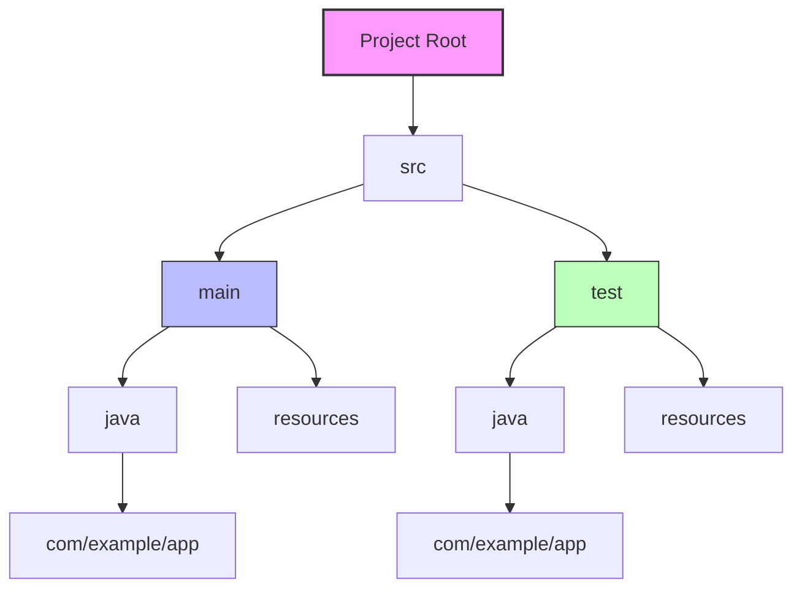

# [Java] 프로젝트 디렉토리 구조 (Project Structure)

> **한 줄 요약**: Gradle/Maven 기반의 표준 Java 프로젝트 디렉토리 구조를 이해하고, 소스 코드와 테스트 코드를 올바르게 배치하는 방법을 설명합니다.

---

## 1. 개념 (Concept)

### 1.1 정의
- **What**: Java 프로젝트에서 소스 파일, 리소스 파일, 테스트 파일 등을 체계적으로 정리하는 표준화된 폴더 구조입니다.
- **Why**: 
    - **유지보수성**: 코드가 어디에 있는지 예측 가능하게 하여 협업 효율을 높입니다.
    - **빌드 자동화**: Gradle이나 Maven 같은 빌드 도구가 기본적으로 이 구조를 따르므로 설정이 간소화됩니다.

### 1.2 핵심 원리 (Core Principles)
- **관심사의 분리**: 소스 코드(`main`)와 테스트 코드(`test`)를 분리합니다.
- **패키지 일치**: 파일 시스템의 디렉토리 구조가 Java 패키지 선언(`package com.example...`)과 정확히 일치해야 합니다.



---

## 2. 구현 및 사용법 (Implementation)

### 2.1 표준 디렉토리 구조
가장 널리 사용되는 Gradle/Maven 표준 구조입니다.

```text
my-project/
├── build.gradle          # 빌드 설정 파일
├── settings.gradle       # 프로젝트 설정 파일
├── gradlew               # Gradle Wrapper (Linux/Mac)
├── gradlew.bat           # Gradle Wrapper (Windows)
└── src/
    ├── main/
    │   ├── java/         # 애플리케이션 소스 코드
    │   │   └── com/
    │   │       └── example/
    │   │           └── app/
    │   │               └── Main.java
    │   └── resources/    # 설정 파일, 이미지 등 리소스
    │       └── application.properties
    └── test/
        ├── java/         # 테스트 소스 코드
        │   └── com/
        │       └── example/
        │           └── app/
        │               └── MainTest.java
        └── resources/    # 테스트 전용 리소스
```

### 2.2 주요 파일 예시

**1) 소스 코드 (`src/main/java/.../Main.java`)**
```java
package com.example.app; // 패키지 선언은 디렉토리 구조와 일치해야 함

public class Main {
    public static void main(String[] args) {
        System.out.println("Hello, Java!");
    }
}
```

**2) 테스트 코드 (`src/test/java/.../MainTest.java`)**
```java
package com.example.app; // 테스트 대상과 동일한 패키지 구조 권장

import org.junit.jupiter.api.Test;
import static org.junit.jupiter.api.Assertions.*;

class MainTest {
    @Test
    void testMain() {
        assertEquals(2, 1 + 1);
    }
}
```

---

## 3. 심화 (Deep Dive)

### 3.1 패키지와 디렉토리의 관계
- Java 컴파일러(`javac`)와 런타임(`java`)은 패키지 이름의 점(`.`)을 디렉토리 구분자(`/` 또는 `\`)로 해석합니다.
- **잘못된 예**:
    - 파일 경로: `src/main/java/Main.java` (패키지 폴더 없음)
    - 코드: `package com.example;`
    - 결과: 컴파일 에러 또는 런타임 시 `ClassNotFoundException` 발생.

### 3.2 빌드 도구의 역할 (Gradle/Maven)
- **Source Sets**: 빌드 도구는 `src/main/java`를 컴파일하여 결과물(JAR/WAR)에 포함시키고, `src/test/java`는 테스트 실행 시에만 사용하며 배포물에는 포함하지 않습니다.
- **Resources**: `src/main/resources`의 파일들은 컴파일된 클래스 파일들과 함께 클래스패스(Classpath)의 루트에 복사됩니다.

### 3.3 주의사항 및 트러블슈팅
1.  **중첩된 src 폴더**: `src/main/java/src/...` 처럼 불필요하게 중첩된 구조는 피해야 합니다. IDE가 소스 경로를 인식하지 못할 수 있습니다.
2.  **패키지명 규칙**: 일반적으로 `com.회사명.프로젝트명` 또는 `org.단체명.프로젝트명` 형식을 사용하며, 모두 소문자로 작성합니다.
3.  **Default Package 지양**: 패키지 선언 없이(`default package`) 클래스를 만들면, 다른 패키지에서 해당 클래스를 임포트할 수 없는 등 제약이 생기므로 반드시 패키지를 지정하세요.

---

## 4. 요약 및 체크리스트 (Summary)

- [ ] 프로젝트 루트 아래 `src/main/java`와 `src/test/java`를 구분하여 생성했는가?
- [ ] Java 파일의 `package` 선언이 실제 디렉토리 경로와 일치하는가?
- [ ] 리소스 파일(설정, 이미지 등)은 `src/main/resources`에 위치시켰는가?
- [ ] 패키지명은 소문자로 작성하고, 유니크한 도메인 형식을 따랐는가?
- [ ] 빌드 스크립트(`build.gradle`)가 프로젝트 루트에 존재하는가?

---
*Ref: Gradle User Manual - The Java Library Plugin*