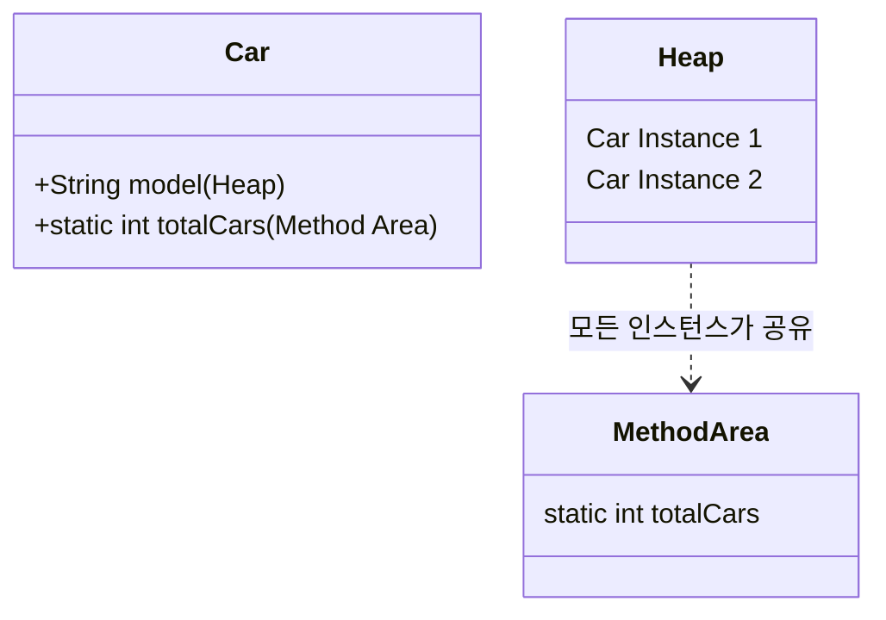

# [Java] Static 키워드와 메모리 관리

> **한 줄 요약**: 객체 생성 없이 클래스 레벨에서 공유되는 멤버를 정의하며, JVM Method Area(Metaspace)에 저장되어 프로그램 종료 시까지 유지되는 키워드입니다.

---

## 1. 개념 (Concept)

### 1.1 정의
- **What**: `static`은 "고정된"이라는 의미로, 클래스에 고정되어 있는 멤버(필드, 메서드)를 정의할 때 사용합니다.
- **Why**: 모든 인스턴스가 공통된 값을 공유해야 하거나, 객체 생성 없이 유틸리티성 기능을 사용해야 할 때 필요합니다.

### 1.2 핵심 원리 (Core Principles)
- **공유(Sharing)**: `static` 멤버는 클래스 당 하나만 생성되며, 모든 인스턴스가 이를 공유합니다.
- **생명주기(Lifecycle)**: 클래스가 메모리에 로딩될 때 생성되고, 프로그램이 종료될 때 해제됩니다.



---

## 2. 구현 및 사용법 (Implementation)

### 2.1 기본 문법
- 필드나 메서드 선언 시 `static` 키워드를 붙입니다.
- 접근 시 `클래스명.멤버명` 형식을 권장합니다.

```java
public class Counter {
    // static 필드 (클래스 변수)
    public static int count = 0;
    
    // 인스턴스 필드
    public int id;

    public Counter() {
        count++;        // 모든 객체가 공유하는 count 증가
        this.id = count; // 각 객체별 고유한 id 할당
    }

    // static 메서드
    public static void printCount() {
        System.out.println("Total count: " + count);
        // System.out.println(id); // 컴파일 에러! static 메서드에서 인스턴스 변수 접근 불가
    }
}
```

### 2.2 주요 예제: 유틸리티 클래스
- `java.lang.Math`와 같이 객체 상태가 필요 없는 순수 기능 제공 클래스에 주로 사용됩니다.

```java
public class MathUtils {
    // 인스턴스화 방지
    private MathUtils() {}

    public static int add(int a, int b) {
        return a + b;
    }
    
    public static final double PI = 3.14159; // 상수 정의
}

// 사용
int result = MathUtils.add(10, 20);
```

---

## 3. 심화 (Deep Dive)

### 3.1 내부 동작 (Internals)

#### JVM 메모리 구조와 저장 위치
- **Method Area (Metaspace)**: `static` 변수는 JVM의 Method Area에 저장됩니다. Java 8부터는 PermGen 영역이 사라지고 Native Memory 영역인 **Metaspace**로 변경되어 관리됩니다.
- **Heap Area**: 일반적인 인스턴스 변수는 객체 생성(`new`) 시 Heap 영역에 할당됩니다.

#### 클래스 로딩 시점 (Class Loading)
- `static` 멤버는 JVM이 클래스를 로드하는 시점(Class Loading Time)에 메모리에 할당되고 초기화됩니다.
- 이는 객체 생성(`new`)보다 훨씬 이른 시점입니다.
- **Static Block**: 복잡한 초기화가 필요한 경우 `static { ... }` 블록을 사용하며, 클래스 로딩 시 단 한 번 실행됩니다.

```java
class Database {
    static Connection conn;
    static {
        try {
            conn = DriverManager.getConnection("...");
        } catch (Exception e) {
            e.printStackTrace();
        }
    }
}
```

### 3.2 싱글톤 패턴 (Singleton Pattern)과의 관계
- 싱글톤 패턴은 전역에서 유일한 인스턴스를 보장하기 위해 `static`을 핵심적으로 사용합니다.

```java
public class Singleton {
    // 1. static 변수에 유일한 인스턴스 저장
    private static Singleton instance;

    // 2. 생성자를 private으로 막음
    private Singleton() {}

    // 3. static 메서드로 인스턴스 반환
    public static Singleton getInstance() {
        if (instance == null) {
            instance = new Singleton();
        }
        return instance;
    }
}
```

### 3.3 주의사항 및 트러블슈팅
1.  **메모리 누수 (Memory Leak)**: `static`으로 선언된 `List`나 `Map`에 데이터를 계속 추가하고 비우지 않으면, GC(Garbage Collector)의 대상이 되지 않아 메모리 누수가 발생할 수 있습니다. (Global Reference)
2.  **동시성 문제 (Concurrency)**: 멀티 스레드 환경에서 `static` 변수를 공유하면 Race Condition이 발생할 수 있습니다. `synchronized` 키워드나 `Atomic` 클래스 사용이 필요합니다.
3.  **객체 지향 위배**: 과도한 `static` 사용은 전역 상태를 만들어 의존성을 높이고 테스트를 어렵게 만듭니다.

---

## 4. 요약 및 체크리스트 (Summary)

- [ ] `static` 멤버는 객체 생성 없이 `클래스명.멤버명`으로 접근한다.
- [ ] `static` 변수는 Method Area(Metaspace)에 저장되며 모든 인스턴스가 공유한다.
- [ ] `static` 메서드 내에서는 `this` 키워드나 인스턴스 변수를 사용할 수 없다.
- [ ] 유틸리티 클래스나 상수(`static final`) 정의에 주로 사용된다.
- [ ] 과도한 사용은 메모리 누수와 테스트의 어려움을 초래할 수 있다.

---
*Ref: Java Language Specification - Static Fields*