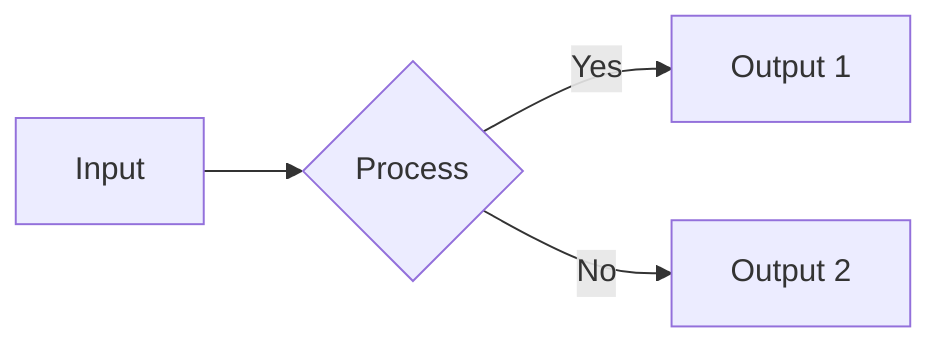

# [Title] 문서 제목 (예: Java Memory Model)

> **한 줄 요약**: 이 문서가 다루는 핵심 내용과 목적을 한 문장으로 요약합니다.

---

## 1. 개념 (Concept)
### 1.1 정의
- **What**: 이것이 무엇인지 명확하게 정의합니다.
- **Why**: 왜 이 기술/개념이 필요한지, 어떤 문제를 해결하는지 설명합니다.

### 1.2 핵심 원리 (Core Principles)
- 작동 방식이나 구조를 설명합니다.
- 필요시 다이어그램(Mermaid)이나 표를 활용하여 시각화합니다.



---

## 2. 구현 및 사용법 (Implementation)
### 2.1 기본 문법 / 설정
- 기본적인 코드 스니펫이나 설정 방법을 제시합니다.

```java
// Java Example
public class Example {
    public static void main(String[] args) {
        // Code here
    }
}
```

### 2.2 주요 예제
- 실무에서 자주 쓰이는 패턴이나 구체적인 사용 사례를 보여줍니다.

---

## 3. 심화 (Deep Dive)
> 이 섹션은 단순 사용법을 넘어 내부 동작 원리나 고급 주제를 다룹니다.

### 3.1 내부 동작 (Internals)
- **Algorithm**: 시간/공간 복잡도, 최악/최선 시나리오, Stable 여부.
- **Java**: JVM 메모리 구조(Stack/Heap), Bytecode 레벨 분석, GC 영향.
- **Cloud**: 아키텍처 패턴, 비용 효율성, 네트워크 패킷 흐름.

### 3.2 주의사항 및 트러블슈팅
- 흔히 발생하는 에러나 성능 이슈, 안티 패턴을 기술합니다.

---

## 4. 요약 및 체크리스트 (Summary)
- [ ] 핵심 키워드 1
- [ ] 핵심 키워드 2
- [ ] 실무 적용 시 기억할 점

---
*Ref: (참고 문헌이나 링크)*