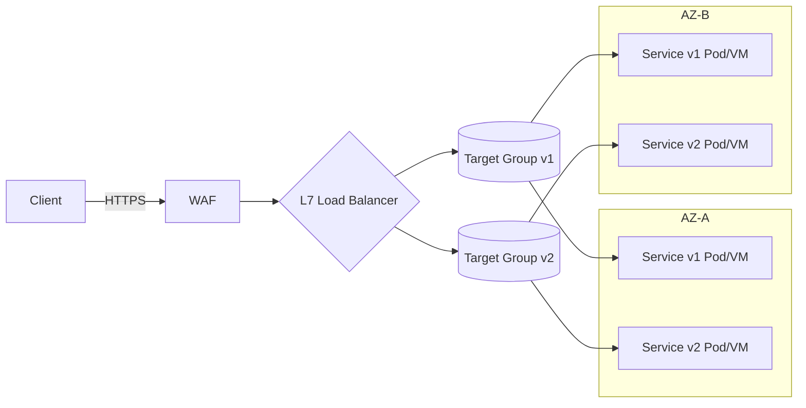
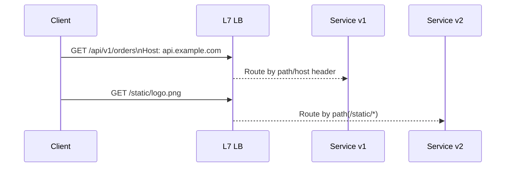

# 클라우드 서비스 모델 정리 (IaaS / PaaS / SaaS / FaaS)

클라우드는 필요한 수준만큼 인프라·플랫폼·애플리케이션 관리를 클라우드 제공자에게 위임해 개발·운영 효율을 높이는 방식이다.

---

## 온프레미스 vs 클라우드
- 온프레미스(On-Premise): 우리가 직접 구축·운영·비용 부담(모든 계층 책임)
- 클라우드: 책임을 단계적으로 이전(IaaS → PaaS → SaaS → FaaS 순으로 고객 책임이 줄어듦)

## 책임 분담(Shared Responsibility) 요약

| 구성요소           | On-Prem | IaaS     | PaaS     | SaaS     | FaaS     |
|-------------------|:-------:|:--------:|:--------:|:--------:|:--------:|
| Networking        | 고객    | 클라우드 | 클라우드 | 클라우드 | 클라우드 |
| Storage           | 고객    | 클라우드 | 클라우드 | 클라우드 | 클라우드 |
| Servers           | 고객    | 클라우드 | 클라우드 | 클라우드 | 클라우드 |
| Virtualization    | 고객    | 클라우드 | 클라우드 | 클라우드 | 클라우드 |
| Operating System  | 고객    | 고객     | 클라우드 | 클라우드 | 클라우드 |
| Middleware        | 고객    | 고객     | 클라우드 | 클라우드 | 클라우드 |
| Runtime           | 고객    | 고객     | 클라우드 | 클라우드 | 클라우드 |
| Data              | 고객    | 고객     | 고객     | 부분/고객| 고객     |
| Application       | 고객    | 고객     | 고객     | 클라우드 | 고객(함수 코드) |

참고: SaaS의 데이터는 사용 범위에 따라 고객이 입력·관리하되, 저장·백업 등은 제공자 관리인 경우가 많음.

---

## IaaS (Infrastructure as a Service)
- 정의: 컴퓨팅(가상머신), 스토리지, 네트워킹 같은 인프라를 서비스로 제공. 높은 유연성과 제어 권한.
- 대표 예시: AWS EC2/EBS/VPC, GCP Compute Engine, Azure Virtual Machines
- 장점: 세밀한 제어, 다양한 아키텍처 구성 가능
- 단점: OS·미들웨어·런타임 관리가 필요(패치, 모니터링, 보안 등)
- 사용 시나리오 예시: 기존 온프레미스 서버를 “리프트 앤 시프트”로 클라우드로 이전할 때, 커스텀 네트워킹/보안이 필요한 대규모 서비스

## PaaS (Platform as a Service)
- 정의: 애플리케이션 실행에 필요한 OS·런타임·미들웨어·빌드/배포 도구 등을 플랫폼으로 제공
- 대표 예시: Heroku, Google App Engine, AWS Elastic Beanstalk, Azure App Service
- 장점: 인프라/OS 관리 부담 감소, 빠른 배포와 스케일링
- 단점: 플랫폼 제약(런타임/빌드팩/네트워킹 제약), 종속성(lock-in) 가능성
- 사용 시나리오 예시: 표준적인 웹/백엔드 앱을 신속히 배포·운영하고 싶은 스타트업/서비스 팀

## SaaS (Software as a Service)
- 정의: 완성된 소프트웨어를 브라우저/클라이언트로 사용. 설치·유지보수 불필요
- 대표 예시: Google Workspace(문서·메일), Slack, Salesforce, Atlassian(Jira/Confluence)
- 장점: 가장 빠른 도입, 운영 부담 거의 없음
- 단점: 커스터마이징 한계, 벤더 종속성, 데이터 이동 제약 가능
- 사용 시나리오 예시: 협업 도구, CRM, 헬프데스크 등 비즈니스 애플리케이션을 바로 사용

## FaaS (Functions as a Service) = 서버리스 함수
- 정의: 서버를 신경 쓰지 않고 함수 단위 코드를 실행. 사용 시간/호출 수 기반 과금
- 대표 예시: AWS Lambda, Google Cloud Functions, Azure Functions
- 장점: 자동 확장, 무중단 운영, 짧은 작업에 비용 효율적
- 단점: 콜드 스타트, 실행 시간/메모리 제한, 상태 관리 설계 필요
- 사용 시나리오 예시: 이벤트 기반 처리(이미지 리사이징, 로그 처리, 웹훅 핸들러)

예제 코드(Python, AWS Lambda 스타일):
```python
import json

def handler(event, context):
    name = (event or {}).get("name", "World")
    return {
        "statusCode": 200,
        "headers": {"Content-Type": "application/json"},
        "body": json.dumps({"message": f"Hello, {name}!"})
    }
```

---

## 언제 무엇을 선택할까?
- 높은 제어·커스터마이징 필요: IaaS
- 빠른 배포/운영 단순화: PaaS
- 기능을 바로 사용(비즈 앱): SaaS
- 이벤트 기반·간헐적 워크로드·간단 API: FaaS

## 빠른 요약
- IaaS: 인프라는 제공, OS 위부터는 고객 책임. 유연성↑, 관리 부담↑
- PaaS: 실행 플랫폼 제공. 배포·스케일 쉬움, 제약 존재
- SaaS: 완성 서비스 사용. 가장 간단, 커스터마이징 한계
- FaaS: 함수 실행만 신경. 이벤트 처리·자동 확장에 적합

---

## 부록: 용어 정정
- Virtualization(가상화), Middleware(미들웨어) 철자 및 개념 정리
- 예시 서비스와 명칭을 최신화(예: Google Docs 등)

---

## 클라우드 핵심 기술

### 1) 가상화·컨테이너·오케스트레이션
- 가상화(Virtualization)
  - Type 1(베어메탈): 물리 서버 위 하이퍼바이저가 직접 VM 관리(KVM/ESXi)
  - Type 2(호스트형): 호스트 OS 위 하이퍼바이저가 동작(VMware Workstation/VirtualBox)
- 컨테이너(Container): 프로세스 격리 기반. 이미지 표준화·경량·빠른 배포(Docker/OCI)
- 오케스트레이션(Kubernetes): 스케줄링, 자동 복구, 롤링 업데이트, HPA로 자동 확장

예제(Kubernetes, 간단한 웹 배포):
```yaml
apiVersion: apps/v1
kind: Deployment
metadata:
  name: web
spec:
  replicas: 2
  selector:
    matchLabels: { app: web }
  template:
    metadata:
      labels: { app: web }
    spec:
      containers:
        - name: nginx
          image: nginx:1.25
          ports: [{ containerPort: 80 }]
---
apiVersion: v1
kind: Service
metadata:
  name: web
spec:
  type: ClusterIP
  selector: { app: web }
  ports: [{ port: 80, targetPort: 80 }]
```

### 2) 네트워킹·트래픽 관리

#### 2.1 네트워킹 기본
- VPC/VNet, Subnet, Route Table, NAT/IGW로 퍼블릭·프라이빗 분리
- 보안그룹/NSG(Stateful) vs NACL(Stateless) 역할 구분
- 일반 패턴: 퍼블릭-프라이빗 서브넷 분리, Bastion/SSM 접근, WAF 전면 배치, 종단 간 TLS

#### 2.2 로드 밸런싱 개념
- L4 vs L7: 전송 계층(TCP/UDP) 분산 vs 애플리케이션 계층(HTTP/HTTPS) 라우팅
- 주요 기능: 헬스 체크, 가중 분산, 세션 고정, SSL 종료/패스스루, Cross-Zone, 멀티 AZ
- 라우팅 유형: 경로/호스트 기반, 헤더/쿠키 기반, 가중치/버전 기반(카나리·블루그린)
- DNS 기반 분산: 레이턴시/지리/가중치/페일오버 정책으로 GSLB 구현

개념도: 퍼블릭 L7 LB가 다중 AZ로 트래픽을 분산


개념도: L7에서 경로/호스트 기반 라우팅


#### 2.3 서비스 메시
- 서비스 간 통신(동일 VPC/K8s 내부)에 L7 정책·mTLS·리트라이·레이트리밋 적용(Istio/Linkerd)

### 3) 스토리지
- 오브젝트(S3/GCS), 블록(EBS/Persistent Disk), 파일(EFS/FSx/Filestore)
- 수명주기 관리(Lifecycle), 버전관리, 암호화(KMS)로 비용·보안 최적화

예제(S3 Lifecycle, 30일 후 IA, 365일 후 만료):
```json
{
  "Rules": [
    {
      "ID": "logs-lifecycle",
      "Status": "Enabled",
      "Prefix": "logs/",
      "Transitions": [{ "Days": 30, "StorageClass": "STANDARD_IA"}],
      "Expiration": { "Days": 365 }
    }
  ]
}
```

### 4) 메시징·이벤트 드리븐
- 큐/스트림: SQS, Pub/Sub, Kafka, Kinesis로 비동기 처리·버퍼링
- 이벤트 버스: EventBridge, CloudEvents. 팬아웃·필터링·재시도

예제(AWS CLI, SQS 메시지 전송):
```bash
aws sqs send-message \
  --queue-url https://sqs.ap-northeast-2.amazonaws.com/111122223333/my-queue \
  --message-body '{"orderId":123,"event":"CREATED"}'
```

### 5) IaC(Infrastructure as Code)
- 선언형 관리: Terraform, CloudFormation, Pulumi로 재현성/검토/승인을 체계화
- 모듈·워크스페이스·원격 상태 관리로 협업 강화

예제(Terraform, 최소 S3 버킷):
```hcl
provider "aws" { region = "ap-northeast-2" }
resource "aws_s3_bucket" "demo" {
  bucket        = "my-demo-bucket-12345"
  force_destroy = true
}
```

### 6) CI/CD
- GitHub Actions, GitLab CI, Argo CD, CodePipeline/Build/Deploy
- 패턴: trunk-based, PR 체크, 카나리/블루그린, 인프라와 앱 파이프라인 분리

### 7) 관측성(Observability)
- 메트릭(Prometheus/Cloud Monitoring), 로그(CloudWatch/Cloud Logging), 트레이스(OpenTelemetry)
- SLI/SLO 설정, 경보(알림), 지표-로그-트레이스 연계로 근본 원인 추적

### 8) 보안
- IAM 최소 권한, KMS/Secret Manager, 네트워크 분리, WAF/Shield, 패치 자동화

예제(IAM 정책, S3 읽기 전용):
```json
{
  "Version": "2012-10-17",
  "Statement": [
    {
      "Effect": "Allow",
      "Action": ["s3:GetObject"],
      "Resource": "arn:aws:s3:::example-bucket/*"
    }
  ]
}
```

### 9) 캐시·CDN·엣지
- CDN(CloudFront/Cloud CDN)으로 전송 지연 감소, 오리진 보호, 캐시 전략(TTL/무효화)
- 애플리케이션 캐시(Redis/Memcached), 데이터베이스 리드 레플리카로 읽기 부하 분산

### 10) 신뢰성·가용성·DR
- 멀티-AZ 기본, 필요시 멀티-리전. 백업·스냅샷·재해복구(RTO/RPO) 목표 수립
- 회로 차단기, 재시도·지수 백오프, 아이들포텐시 키 등 탄력성 패턴 적용

### 11) 비용·거버넌스
- 태깅·조직·계정 분리, 예산·알림, 권한 위임
- 리소스 라이트사이징, 스팟/프리엠티브, 예약/세이빙 플랜, S3 수명주기
---

## 로드 밸런싱에서 파생되는 개념
### 오토스케일링 (Auto Scaling)
- 서비스가 집중되었을 때 서버 리소스를 일정 사용량을 초과하면 자동으로 가상 서버 대수를 증감시키는  기능
- 증가 뿐만 아니라 감소도 적용가능함 

### 스케일 아웃
- 물리적 서버를 늘려서 시스템을 확장
- 서버가 늘어나므로 보통 로드 밸런싱과 같이 연계하여 사용됨
모든 서버가 동일한 데이러르 가지고 있어야 하므로 데이터 변화가 적은 서비스에 적합함   
    - 데이터 복사하는 경우, 데이터 처리 하는 방식에 따른 서버의 역할에 따라 달라질 수 있음.
    - 서버 속도가 더 느려질 수 있음 (성능 향상을 위한 작업을 수행해도 잘못된 시스템 아키텍처 설계 시 오히려 성능 저하 가능성 존재)

### 스케일 업
- 서버 자체의 성능을 업그레이드하여 처리 능력을 향상시킴
- 수직 스케일 이라고도 함
- 고성능 시피유, 메모리 추가 혹은 가상 서버를 고성능 서버로 옮기는 작업 

### 하이브리드 방식
- 스케일 업 + 스케일 아웃 같이 병행해서 사용하는 경우

---

### AWS 의 시작 - 잡썰? 
- 기존의 관념을 뒤엎다 - 제픔 베이조스 
- 아마존은 'platform' 이다. buyer - seller 를 연결시키는 기반을 제공한 것 (플라이 휠 기반 성장 전략 **Flywheel**)


---

## 리전 (Region)
- 물리적으로 떨어진 지역에 여러 개의 클라우드 인프라를 운영함.
- 해당 각 지역을 리전 (region) 이라고 부름.
> 서울 리전, 미국 버지니아 북부 리전 등. 
- AWS 기준, 2025년 기준으로 총 41개의 리전을 관리 및 운영하고 있음. 
- 물리적으로 멀리 떨어지면 경유 라우터 개수가 많아져서 네트워크 속도가 느려진다. 
- 가까운 리전에 접속 후 클라우드 서비스를 제공해야 빠른 속도를 보장할 수 있음.

### 가용영역 (Availability Zone, AZ)
- Region 은 큰 단위 개념 (국가 개념) - 여러 AZ 들의 집합임 
- AZ, 데이터 센터를 의미함 (IDC)
- 특정 AZ 가 작동 불능이 되어도 다른 AZ가 대체 가능함.
- 물리적으로 서로 독립되어 있으나 AWS 등의 콘솔에서는 구분되지 않음
- 로드 밸런싱의 역할도 수행함 - 하나의 서버 과부하 발생 시 다른 AZ으로 해당 트래픽 요청을 처리하는 방식으로 리소스 과부하 방지
- IDC 는 자사가 직접 구축하는 경우도 있지만, 기존 타사의 IDC등을 대여하여 사용하기도 함.

### 엣지 로케이션 (Edge Location)
- CDN 과 연관되는 개념
- 리전에 속한 '리전 에지 캐시'를 통해 데이터 속도를 개선함 (즉 캐싱 방법 적용함)
-> Edge networking (network web-mesh) 와의 구분점은?
- Locality 적용하여 캐싱방안 적용함 

### CDN 
- 오리진 서버 및 지리적으로 분산된 여러 개의 캐시 서버로 구성되어 end-user 에게 콘텐츠를 전송하는 네트워크

---
## AWS SERVICE - 트렌드에 맞춰 변경 가능성 존재함
### Amazon EC2
- 아마존 최초 서비스? 저장
### Amazon Auto Scaling
- 활성화 하지 않으면 직접 스케일링 작업해야함 
### Amazon LightSail
### Amazon Route 53
- 클라우드 기반 DNS 웹 서비스 
- AWS 위의 다양한 인프라 및 외부 인프라에 연결 가능
### Amazon VPC 
- 가상 사설 네트워크 인프라를 클라우드 내에 구성
- 리전 간의 peering 가능 (P2p? )
### Amazon S3 
- 범용적인 스토리지 서비스
- 정적인 콘텐츠를 가진 사이트 제작 가능 (간단한 static 기반 사이트)
### Amazon EBS
### Amazon Glacier 
- 사용빈도 높지 않은 서비스(?)
### Amazon RDS, DynamoDB 등
- 디비
---


