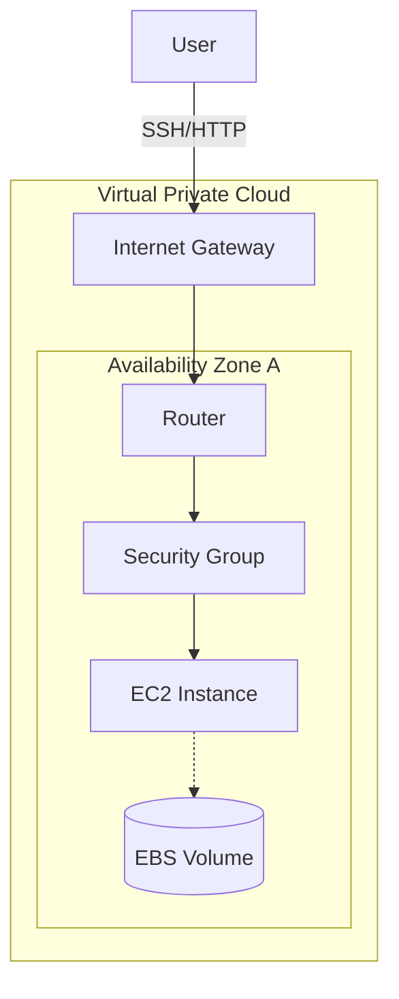
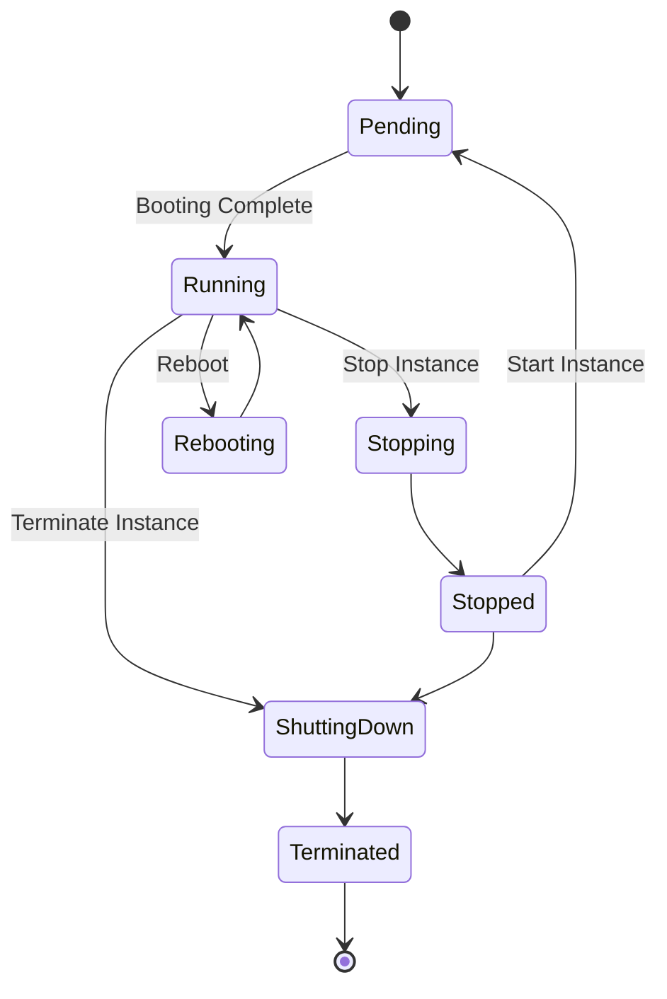

# AWS Computing Service (EC2 & EBS)

> **한 줄 요약**: AWS의 핵심 컴퓨팅 서비스인 EC2의 개념, 인스턴스 유형, 구매 옵션 및 스토리지(EBS)를 심층 분석합니다.

---

## 1. 개념 (Concept)

### 1.1 EC2 (Elastic Compute Cloud)
- **정의**: 안전하고 크기 조정이 가능한 컴퓨팅 파워를 클라우드에서 제공하는 웹 서비스입니다.
- **특징**:
    - **가상화**: 물리적 서버 위에 하이퍼바이저를 통해 생성된 가상 머신(Instance)입니다.
    - **확장성**: 몇 분 안에 인스턴스 용량을 늘리거나 줄일 수 있습니다 (Auto Scaling).
    - **제어권**: Root 권한을 포함하여 인스턴스를 완전히 제어할 수 있습니다.

### 1.2 아키텍처 개요
EC2는 특정 리전(Region)의 가용 영역(AZ) 내에 배치됩니다.

---

## 2. 구성 요소 및 사용 (Components)

### 2.1 인스턴스 유형 (Instance Types)
인스턴스 이름(예: `m5.large`)은 다음과 같은 규칙을 따릅니다.
- **패밀리 (m)**: 용도 (m=범용, c=컴퓨팅, r=메모리, g=그래픽 등)
- **세대 (5)**: 하드웨어 세대 (숫자가 높을수록 최신)
- **크기 (large)**: vCPU 및 메모리 용량

### 2.2 구매 옵션 (Purchasing Options)
비용 최적화를 위해 상황에 맞는 옵션을 선택해야 합니다.

| 옵션 | 설명 | 특징 | 추천 용도 |
| :--- | :--- | :--- | :--- |
| **On-Demand** | 초/시간 단위 과금 | 약정 없음, 가장 비쌈 | 단기 워크로드, 개발/테스트 |
| **Reserved (RI)** | 1년/3년 약정 | 온디맨드 대비 최대 72% 할인 | DB 등 상시 가동되는 워크로드 |
| **Spot** | 남는 용량 경매 | 최대 90% 할인, **중단 가능성** | 배치 처리, CI/CD, 무상태 웹 서버 |
| **Dedicated** | 전용 하드웨어 | 물리 서버 격리 | 라이선스 이슈, 규정 준수 필요 시 |
| **Savings Plans** | 1년/3년 약정 (금액) | 유연한 할인 모델 (EC2+Fargate+Lambda) | 최신 비용 절감 모델 |

### 2.3 EBS (Elastic Block Store)
- **정의**: EC2 인스턴스에 연결하여 사용하는 **블록 수준 스토리지**입니다. (서버의 하드디스크 역할)
- **특징**:
    - **가용성**: 단일 AZ 내에서 자동으로 복제되어 데이터 손실을 방지합니다.
    - **스냅샷 (Snapshot)**: S3에 증분 백업을 저장할 수 있습니다.
    - **분리 가능**: 인스턴스가 종료되어도 EBS는 유지할 수 있습니다 (설정에 따름).

---

## 3. 심화 (Deep Dive)

### 3.1 인스턴스 수명 주기 (Lifecycle)
인스턴스는 생성부터 종료까지 다양한 상태를 거칩니다.

- **Stopped**: 인스턴스가 꺼져 있지만 EBS 데이터는 유지됨. (컴퓨팅 비용 X, 스토리지 비용 O)
- **Terminated**: 인스턴스가 영구 삭제됨. (기본적으로 Root EBS도 삭제됨)

### 3.2 보안 그룹 (Security Group)
- **성격**: 인스턴스 레벨의 **Stateful** 가상 방화벽입니다.
- **Inbound**: 기본적으로 모든 트래픽 차단 (허용 규칙만 추가 가능).
- **Outbound**: 기본적으로 모든 트래픽 허용.
- **Stateful**: 요청(Inbound)이 허용되면, 응답(Outbound)은 규칙과 상관없이 자동으로 허용됩니다.

### 3.3 User Data
- 인스턴스 최초 실행(Bootstrapping) 시 자동으로 실행할 쉘 스크립트를 지정할 수 있습니다.
- 패키지 설치, 업데이트, 설정 파일 다운로드 등에 사용됩니다.

---

## 4. 요약 및 체크리스트 (Summary)
- [ ] **EC2**는 가상 서버, **EBS**는 가상 디스크이다.
- [ ] **Spot 인스턴스**는 저렴하지만 언제든 회수될 수 있어 무상태(Stateless) 앱에 적합하다.
- [ ] **보안 그룹**은 Stateful하며 인스턴스 앞단의 방화벽 역할을 한다.
- [ ] **스냅샷**을 통해 EBS 데이터를 S3에 백업하고 복원할 수 있다.

---
*Ref: AWS EC2 User Guide, AWS Pricing Page*